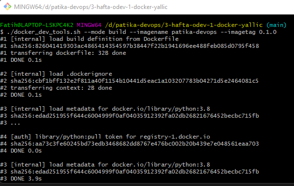
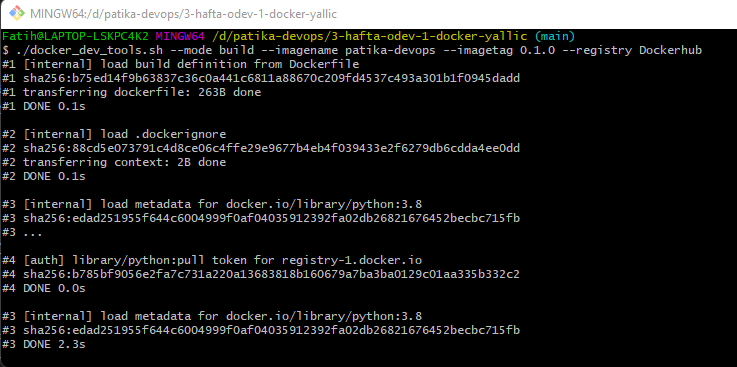
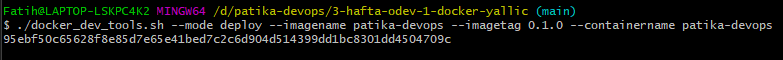
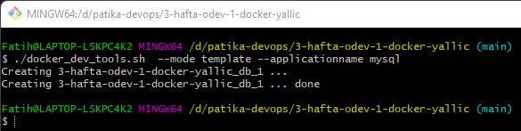

### 3.Hafta 1.Odev
---

## Table of contents[](#table-of-contents)

1. [Description](#Description)
2. [Usage](#usage)

---

#### Description: (#Description)

This project includes a script that has 3 options. These are `Build`, `Deploy` and `Template`.

**1. Build Mode**  Build mode build a docker image and if registry option is given, it pushes to image to selected registry.The example output screen without the registry option  is below :



The example output screen w,th the registry option  is below :



**2. Deploy Mode** Deploy mode runs to builded docker image. If user wants to limit memory and CPU resource, the user can use options for limitation. An example that uses all options is below:



**3. Template Mode** Template mode runs MySql or MongoDB app.The example output screen is below :




#### Example Usage: [](#usage)


```shell

$ docker_dev_tools.sh

Usage:
    --mode              Select mode <build|deploy|template> 
    --image-name        Docker image name
    --image-tag         Docker image tag
    --memory            Container memory limit
    --cpu               Container cpu limit
    --container-name    Container name
    --registery         DocherHub or GitLab Image registery
    --application-name  Run mysql or mongo server
```

